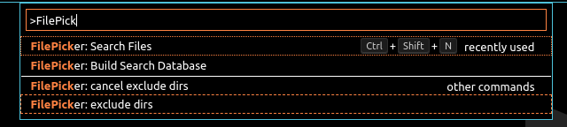
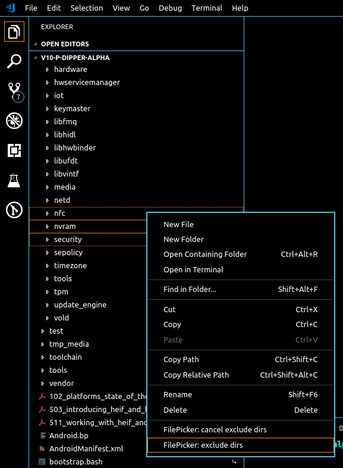

# Quick File Picker

# How to use
Hit `Ctrl + Shirft + P` and input 'FilePicker', you'll see:
```
> FilePicker: Search Files
> FilePicker: Build Search Database
```
## Screenshot


## Steps:
1. exclude certain directories that you want to ignore
   
2. built the search database, you have to manually execute the command.
3. search for files
 
That's it!

# TODO
- follow symbolic links during build search database

# How To Run Locally
Clone this project into your local disk and open it in vscode, press F5, there you go!

# Bugs
Visit https://github.com/wwm0609/quickfilepicker/ and file an issue
